# UniFIAP Pay SPB - Sistema de Pagamentos Brasileiro


## 📋 Sobre o Projeto

O **UniFIAP Pay SPB** é uma implementação acadêmica de um sistema de pagamentos instantâneos (PIX) que simula a arquitetura do Sistema de Pagamentos Brasileiro (SPB). O projeto demonstra boas práticas de containerização, orquestração com Kubernetes e segurança em ambientes cloud-native.

### 🎯 Objetivos

- Simular o funcionamento do **Banco Originador** (UniFIAP Pay)
- Implementar o processo de **liquidação** através do Sistema de Transferência de Reservas (STR/BACEN)
- Demonstrar conceitos de **microserviços**, **persistência compartilhada** e **automação**

---

## 🏗️ Arquitetura

O sistema é composto por 2 microserviços principais:

### 1. **API de Pagamentos** (`api-pagamentos`)
- **Função**: Simula o Banco Originador (UniFIAP Pay)
- **Responsabilidades**:
  - Receber requisições de PIX via endpoint `/pix`
  - Validar transações contra a reserva bancária
  - Registrar transações no "Livro-Razão" (log compartilhado)
  - Gerenciar estados: `AGUARDANDO_LIQUIDACAO`
- **Tecnologia**: Node.js + Express
- **Porta**: 3000

### 2. **Serviço de Auditoria** (`auditoria-service`)
- **Função**: Simula o Sistema de Liquidação (BACEN/STR)
- **Responsabilidades**:
  - Executar auditoria periódica (a cada 6 horas)
  - Processar transações pendentes
  - Atualizar status para `LIQUIDADO`
- **Tecnologia**: Node.js (script batch)
- **Execução**: CronJob do Kubernetes

### 📊 Diagrama de Fluxo

```
[Cliente] → POST /pix → [API Pagamentos] → [Livro-Razão PVC]
                              ↓                      ↑
                        Valida Reserva               |
                         (ConfigMap)                 |
                                                     |
                    [CronJob: Auditoria] ← ─ ─ ─ ─ ─ ┘
                    (Liquidação a cada 6h)
```

---

## 🗂️ Estrutura do Projeto

```
unifiapgs-k8s/
├── api-pagamentos/          # Microserviço API de Pagamentos
│   ├── Dockerfile           # Multi-stage build com Alpine
│   ├── package.json         # Dependências (Express)
│   └── src/
│       └── index.js         # Servidor Express + lógica PIX
│
├── auditoria-service/       # Microserviço de Liquidação
│   ├── Dockerfile           # Multi-stage build com Alpine
│   ├── package.json         # Dependências Node.js
│   └── src/
│       └── index.js         # Script de auditoria/liquidação
│
├── k8s/                     # Manifestos Kubernetes
│   ├── 01-namespace-config-secret.yaml  # Namespace + ConfigMap + Secret
│   ├── 02-pvc.yaml                      # PersistentVolumeClaim (Livro-Razão)
│   ├── 03-api-deployment.yaml           # Deployment da API (2 réplicas)
│   └── 04-auditoria-cronjob.yaml        # CronJob de auditoria (6h)
│
├── docker/                  # Recursos Docker
│   └── pix.key              # Chave PIX de simulação
│
├── images/                  # Prints/evidências do desafio
│
└── README.md                # Este arquivo
```

---

## 🚀 Tecnologias Utilizadas

- **Runtime**: Node.js 20 (Alpine)
- **Framework Web**: Express.js 4.18
- **Containerização**: Docker (Multi-stage builds)
- **Orquestração**: Kubernetes (Kind para desenvolvimento)
- **Armazenamento**: PersistentVolumeClaim (ReadWriteOnce)
- **Configuração**: ConfigMap e Secret
- **Automação**: CronJob

---

## 📦 Pré-requisitos

Antes de executar o projeto, certifique-se de ter instalado:

- [Docker](https://docs.docker.com/get-docker/) >= 20.10
- [Kubernetes](https://kubernetes.io/docs/setup/) (Kind, Minikube ou cluster remoto)
- [kubectl](https://kubernetes.io/docs/tasks/tools/) >= 1.24
- Conta no [Docker Hub](https://hub.docker.com/) (para push das imagens)

### Verificar instalações:

```bash
docker --version
kubectl version --client
kind --version  # Se usar Kind
```

---

## 🔧 Como Executar

### **Etapa 1: Build das Imagens Docker**

#### 1.1. Build da API de Pagamentos

```bash
cd api-pagamentos
docker build -t robelio/api-pagamentos-spb:v1.RM556786 .
```

#### 1.2. Build do Serviço de Auditoria

```bash
cd ../auditoria-service
docker build -t robelio/auditoria-service-spb:v1.RM556786 .
```

#### 1.3. Push para Docker Hub

```bash
docker push robelio/api-pagamentos-spb:v1.RM556786
docker push robelio/auditoria-service-spb:v1.RM556786
```

---

### **Etapa 2: Deploy no Kubernetes**

#### 2.1. Criar Cluster Kind (opcional)

```bash
kind create cluster --name unifiapay-cluster
kubectl cluster-info --context kind-unifiapay-cluster
```

#### 2.2. Aplicar os Manifestos

```bash
# Namespace, ConfigMap e Secret
kubectl apply -f k8s/01-namespace-config-secret.yaml

# PersistentVolumeClaim (Livro-Razão)
kubectl apply -f k8s/02-pvc.yaml

# Deployment da API (2 réplicas iniciais)
kubectl apply -f k8s/03-api-deployment.yaml

# CronJob de Auditoria (a cada 6 horas)
kubectl apply -f k8s/04-auditoria-cronjob.yaml
```

#### 2.3. Verificar o Deploy

```bash
# Verificar todos os recursos
kubectl get all -n unifiapay

# Verificar pods em execução
kubectl get pods -n unifiapay -o wide

# Verificar logs da API
kubectl logs -n unifiapay -l app=api-pagamentos --tail=50
```

---

## 🧪 Testando o Sistema

### **1. Iniciar Port-Forward para Acessar a API**

```bash
# Iniciar port-forward em background (recomendado)
nohup kubectl port-forward -n unifiapay deployment/api-pagamentos 3000:3000 > /tmp/port-forward.log 2>&1 &

# OU iniciar em foreground (mantém terminal ocupado)
kubectl port-forward -n unifiapay deployment/api-pagamentos 3000:3000
```

### **2. Testar no Navegador**

Abra seu navegador e acesse:

- **Rota Raiz (Documentação)**: http://localhost:3000/
- **Health Check**: http://localhost:3000/health

Você verá o JSON formatado automaticamente! 🎨

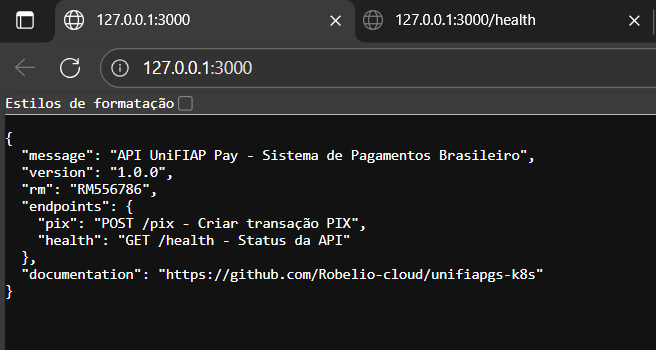

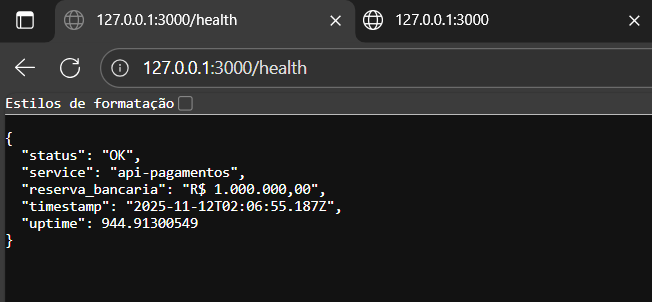

### **3. Enviar uma Transação PIX**

```bash
# Enviar requisição PIX
curl -X POST http://localhost:3000/pix \
  -H "Content-Type: application/json" \
  -d '{
    "id_transacao": "TX-001",
    "valor": 150.00
  }'

# Resposta esperada:
# {"status":"PIX Aceito","transacao":"TX-001","estado":"AGUARDANDO_LIQUIDACAO"}
```

### **4. Verificar o Livro-Razão**

```bash
# Listar os pods disponíveis
kubectl get pods -n unifiapay -l app=api-pagamentos

# Acessar um dos pods da API (substitua <POD-NAME> pelo nome real)
kubectl exec -it -n unifiapay <POD-NAME> -- /bin/sh

# Dentro do pod, verificar o log
cat /var/logs/api/instrucoes.log
# Saída: 2025-11-11T... | TX-001 | 150 | AGUARDANDO_LIQUIDACAO

# Sair do pod
exit
```

### **5. Testar o Volume Compartilhado**

```bash
# Listar os pods
kubectl get pods -n unifiapay -l app=api-pagamentos

# Exemplo de saída:
# NAME                              READY   STATUS    RESTARTS   AGE
# api-pagamentos-648f577b6f-675s6   1/1     Running   0          10m
# api-pagamentos-648f577b6f-dmtqk   1/1     Running   0          10m

# Escrever no log a partir do Pod 1
kubectl exec -it -n unifiapay api-pagamentos-648f577b6f-675s6 -- sh -c "echo 'TESTE_POD_1' >> /var/logs/api/instrucoes.log"

# Ler do Pod 2 (deve mostrar o texto escrito pelo Pod 1)
kubectl exec -it -n unifiapay api-pagamentos-648f577b6f-dmtqk -- cat /var/logs/api/instrucoes.log
# Deve mostrar: TESTE_POD_1
```

### **6. Executar a Auditoria Manualmente**

```bash
# Criar um Job a partir do CronJob
kubectl create job -n unifiapay auditoria-manual --from=cronjob/auditoria-service

# Acompanhar a execução (Ctrl+C para sair)
kubectl get pods -n unifiapay --watch

# Ver logs da auditoria (substitua pelo nome do pod real)
kubectl logs -n unifiapay -l job-name=auditoria-manual

# Saída esperada:
# [Auditoria] Iniciando processo de liquidação...
# [Auditoria] Processo de liquidação concluído. Status atualizado para LIQUIDADO.
```

### **7. Escalar a API**

```bash
# Escalar para 4 réplicas
kubectl scale deployment api-pagamentos -n unifiapay --replicas=4

# Verificar (deve mostrar 4 pods rodando)
kubectl get pods -n unifiapay -l app=api-pagamentos

# Voltar para 2 réplicas
kubectl scale deployment api-pagamentos -n unifiapay --replicas=2
```

### **8. Verificar Logs em Tempo Real**

```bash
# Ver logs de todos os pods da API
kubectl logs -n unifiapay -l app=api-pagamentos --tail=20

# Seguir logs em tempo real (Ctrl+C para sair)
kubectl logs -n unifiapay -l app=api-pagamentos -f

# Ver logs de um pod específico
kubectl logs -n unifiapay deployment/api-pagamentos --tail=50
```

### **9. Limpar Port-Forward**

```bash
# Matar todos os processos port-forward
pkill -f "port-forward"

# Verificar se há processos rodando na porta 3000
lsof -ti:3000 | xargs kill -9
```

---

## 🎛️ Interface de Gerenciamento Web - Kubernetes Dashboard

### **Por que Kubernetes Dashboard em vez de Rancher?**


Inicialmente foi considerado o uso do **Rancher**, uma plataforma robusta de gerenciamento multi-cluster. Porém, devido a:
- ❌ Incompatibilidade com Kubernetes 1.34+ (versão utilizada no projeto)
- ❌ Alta complexidade e recursos desnecessários para um único cluster
- ❌ Peso elevado (>1GB RAM) inadequado para ambiente de desenvolvimento

Optou-se pelo **Kubernetes Dashboard oficial**, que oferece:
- ✅ Compatibilidade total com Kubernetes 1.34+
- ✅ Ferramenta oficial da CNCF (Cloud Native Computing Foundation)
- ✅ Leveza e simplicidade (~50MB)
- ✅ Interface limpa e intuitiva
- ✅ Todas as funcionalidades necessárias para o projeto

### **Instalação do Kubernetes Dashboard:**

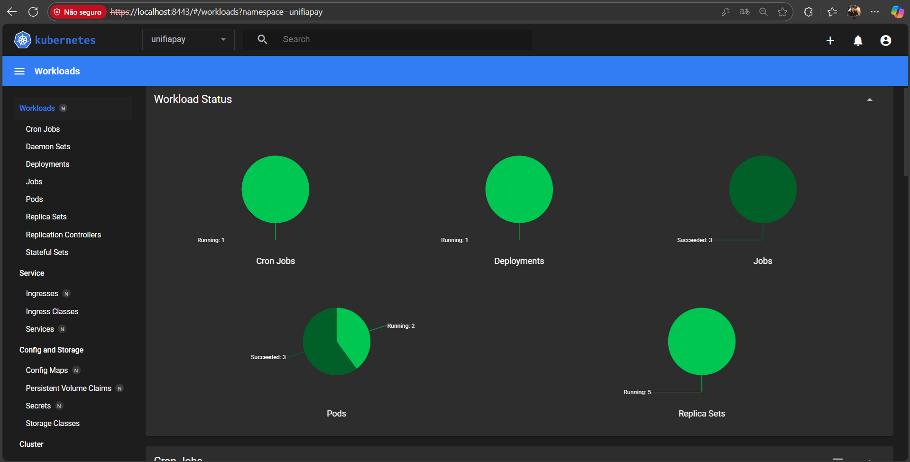

```bash
# Instalar o Dashboard
kubectl apply -f https://raw.githubusercontent.com/kubernetes/dashboard/v2.7.0/aio/deploy/recommended.yaml

# Criar usuário admin
kubectl apply -f rancher/dashboard-admin.yaml

# Gerar token de acesso
kubectl -n kubernetes-dashboard create token admin-user
```

### **Acessar o Dashboard:**

```bash
# 1. Iniciar port-forward
kubectl port-forward -n kubernetes-dashboard svc/kubernetes-dashboard 8443:443

# 2. Abrir no navegador (aceitar certificado autoassinado)
# https://localhost:8443

# 3. Fazer login com o token gerado no passo anterior
```

### **Uso em Background (Recomendado):**

```bash
# Port-forward permanente em background
nohup kubectl port-forward -n kubernetes-dashboard svc/kubernetes-dashboard 8443:443 > /tmp/dashboard.log 2>&1 &

# Parar port-forward quando necessário
pkill -f "port-forward"
```

### **Funcionalidades Disponíveis:**

- ✅ **Visualizar recursos** - Deployments, Pods, Services, ConfigMaps, Secrets
- ✅ **Ver logs em tempo real** - Acompanhar execução da API e auditoria
- ✅ **Executar shell nos containers** - Debug e inspeção de arquivos
- ✅ **Escalar aplicações** - Alterar número de réplicas visualmente
- ✅ **Monitorar recursos** - CPU/Memory de pods e containers
- ✅ **Gerenciar CronJobs** - Verificar execuções da auditoria
- ✅ **Editar recursos** - Modificar YAML diretamente na interface

### **Navegação no Dashboard:**

1. **Selecione o namespace**: `unifiapay` (dropdown no topo da página)
2. Acesse as seções do menu lateral:
   - **Workloads → Deployments** - Ver `api-pagamentos` (2 réplicas)
   - **Workloads → Pods** - Ver pods em execução
   - **Workloads → Cron Jobs** - Ver `auditoria-service`
   - **Storage → Persistent Volume Claims** - Ver `livro-razao-pvc`
   - **Config and Storage → Config Maps** - Ver `api-config` (reserva bancária)
   - **Config and Storage → Secrets** - Ver `api-secrets` (chave PIX)

### **Ações Comuns:**

```bash
# Ver logs de um pod no Dashboard:
# Workloads → Pods → Clique no pod → Ícone "Logs" (canto superior direito)

# Executar shell em um pod:
# Workloads → Pods → Clique no pod → Ícone "Exec" (terminal)

# Escalar deployment:
# Workloads → Deployments → api-pagamentos → Editar → Alterar replicas
```

📖 **Documentação completa**: [`rancher/README-DASHBOARD.md`](rancher/README-DASHBOARD.md)

💡 **Nota sobre Rancher**: A tentativa de instalação do Rancher está documentada em [`rancher/README-RANCHER.md`](rancher/README-RANCHER.md) para referência. O erro de incompatibilidade com Kubernetes 1.34+ levou à escolha técnica consciente pelo Dashboard oficial.

---

## �🔒 Segurança Implementada

### **1. Multi-Stage Builds**
- **Estágio 1 (Builder)**: Instala dependências e prepara código
- **Estágio 2 (Final)**: Copia apenas arquivos necessários, reduzindo tamanho e superfície de ataque

### **2. Usuário Não-Root**
```dockerfile
RUN addgroup -S appgroup && adduser -S appuser -G appgroup
USER appuser
```

### **3. SecurityContext no Kubernetes**
```yaml
securityContext:
  runAsNonRoot: true
  runAsUser: 1000
```

### **4. Limites de Recursos**
```yaml
resources:
  requests:
    cpu: "100m"
    memory: "128Mi"
  limits:
    cpu: "200m"
    memory: "256Mi"
```

### **5. Secrets para Dados Sensíveis**
- Chave PIX armazenada em `Secret` (não hardcoded)

---

## 📊 Recursos Kubernetes

| Recurso | Nome | Tipo | Descrição |
|---------|------|------|-----------|
| Namespace | `unifiapay` | Namespace | Isolamento lógico |
| ConfigMap | `api-config` | ConfigMap | Reserva bancária (R$ 1.000.000) |
| Secret | `api-secrets` | Secret | Chave PIX |
| PVC | `livro-razao-pvc` | PersistentVolumeClaim | Armazenamento compartilhado (1Gi) |
| Deployment | `api-pagamentos` | Deployment | API com 2 réplicas |
| CronJob | `auditoria-service` | CronJob | Liquidação a cada 6 horas |

---

## 🎓 Conceitos Demonstrados

### ✅ **Docker**
- Multi-stage builds para otimização
- Imagens Alpine (leves e seguras)
- Usuário não-root
- Boas práticas de camadas

### ✅ **Kubernetes**
- Deployments com múltiplas réplicas
- CronJobs para tarefas agendadas
- ConfigMaps para configuração
- Secrets para dados sensíveis
- PersistentVolumeClaims para persistência
- SecurityContext e limites de recursos

### ✅ **Microserviços**
- Separação de responsabilidades
- Comunicação via volume compartilhado
- Escalabilidade horizontal
- Automação de processos

---

## 📸 Evidências do Desafio

### 3.1. Etapa 1: Docker e Imagem Segura (1,5 pts)

**Print 1: Build Multi-Stage**
- **O que é**: Output do comando `docker build` mostrando os estágios 1/2 e 2/2
- **O que Prova**: Uso de multi-stage build

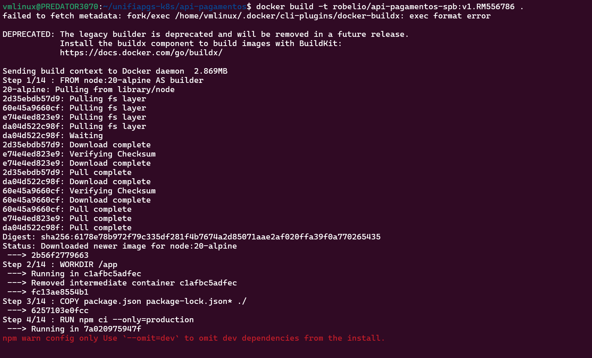
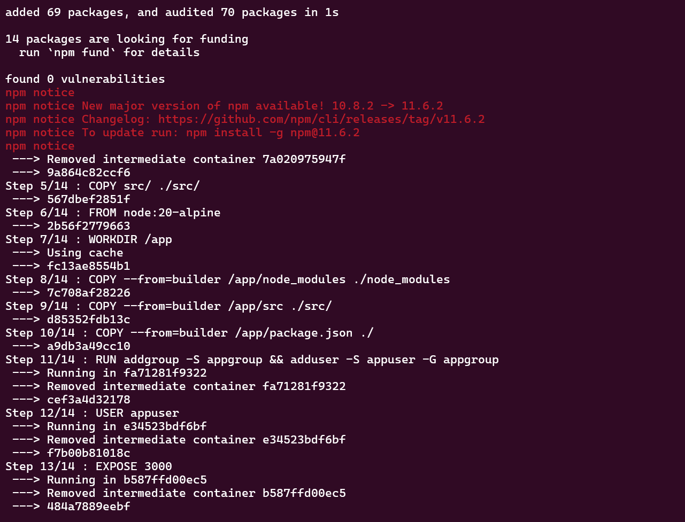
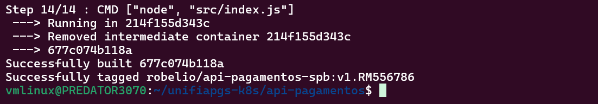

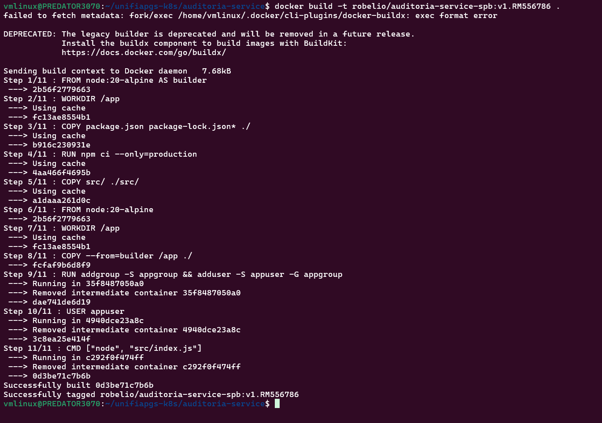


**Print 2: Push no Docker Hub**
- **O que é**: Output dos comandos `docker push robelio/api-pagamentos-spb:v1.RM556786` e `docker push robelio/auditoria-service-spb:v1.RM556786`
- **O que Prova**: Imagens publicadas com tag de RM

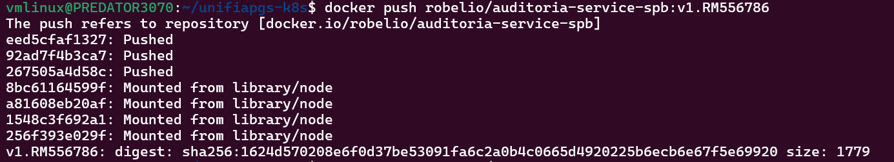

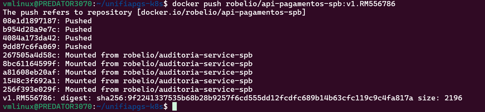

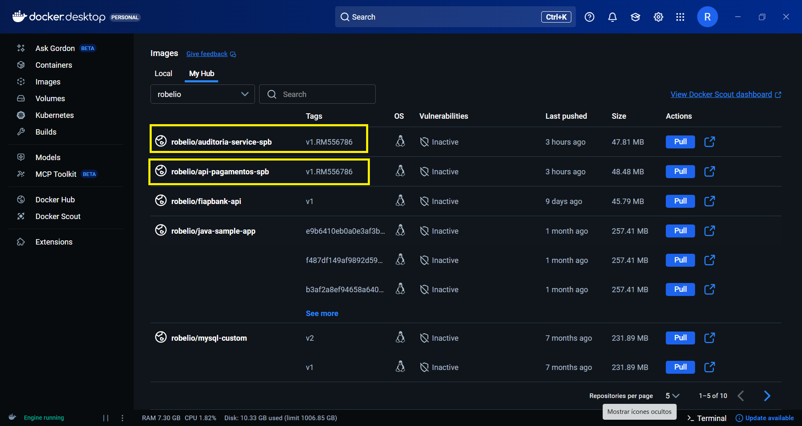

**Print 3: (Evidência de Contorno) Scan de Vulnerabilidade**
- **O que é**: Output mostrando `docker: unknown command: docker scout`
- **O que Prova**: Tentativa de executar scan (plugin não disponível no ambiente)

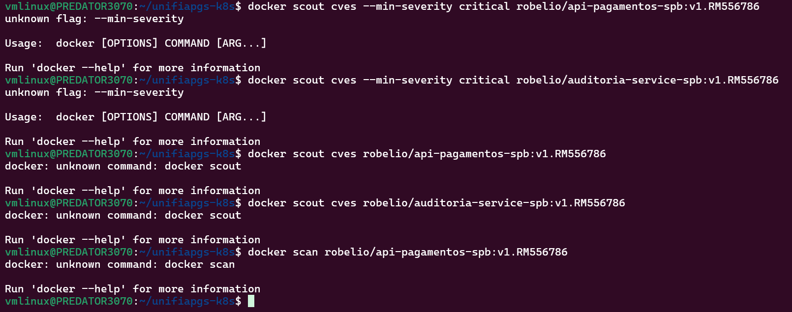

---

### 3.2. Etapa 2: Rede, Comunicação e Segmentação (2,5 pts)

**Print 4: Inspeção da Rede Docker**
- **O que é**: Output do comando `docker network inspect unifiap_net`
- **O que Prova**: Configuração da sub-rede **172.25.0.0/24** com Gateway **172.25.0.1**
- **Comando para reproduzir**:
  ```bash
  # Listar redes Docker do projeto
  docker network ls | grep unifiap
  
  # Inspecionar rede específica
  docker network inspect unifiap_net
  
  # Resultado esperado:
  # - Subnet: 172.25.0.0/24
  # - Gateway: 172.25.0.1
  # - IPs Disponíveis: 253
  ```

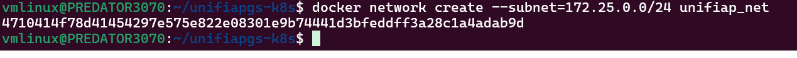

**Detalhes da Rede Docker:**
- **Nome**: `unifiap_net`
- **Driver**: `bridge`
- **Subnet**: `172.25.0.0/24`
- **Gateway**: `172.25.0.1`
- **Range de IPs**: `172.25.0.2` até `172.25.0.254`

**Print 5: Logs da API lendo a Reserva**
- **O que é**: Output de `kubectl exec -it ... -- /bin/sh` e `env | grep RESERVA`
- **O que Prova**: Pod leu o ConfigMap (`RESERVA_BANCARIA_SALDO=1000000.00`)

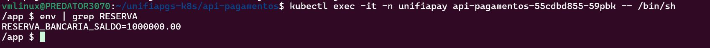

---

### 3.3. Etapa 3: Kubernetes - Estrutura, Escala e Deploy (3,0 pts)

**Print 6: Pods Iniciais (2 Réplicas)**
- **O que é**: Output de `kubectl get pods -n unifiapay` mostrando 2 pods `1/1 Running`
- **O que Prova**: Deployment com 2 réplicas funcionando

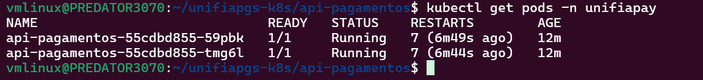

**Print 7: Escala (4 Réplicas)**
- **O que é**: Output de `kubectl get pods -n unifiapay` após `kubectl scale --replicas=4`
- **O que Prova**: Escalabilidade horizontal funcionando

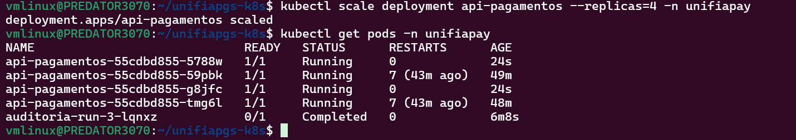

**Print 8: Prova de Escrita/Leitura no Volume Compartilhado**
- **O que é**: Output de `cat /var/logs/api/instrucoes.log` do Pod 2 mostrando `TESTE_DO_POD_1`
- **O que Prova**: Pods compartilham o mesmo PVC

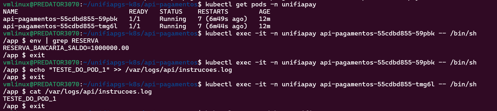

**Print 9: CronJob e Job Concluído**
- **O que é**: Output de `kubectl get pods -n unifiapay` mostrando pod com status `Completed`
- **O que Prova**: CronJob executado com sucesso

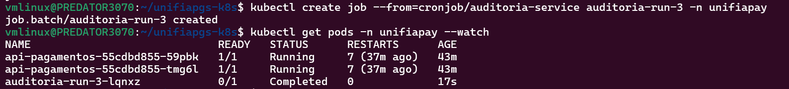

**Print 10: Log do Auditor**
- **O que é**: Output de `kubectl logs -n unifiapay auditoria-run-3-lqnxz`
- **O que Prova**: Script de auditoria rodou e processou o volume

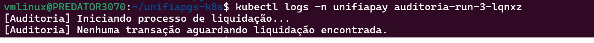

---

### 3.4. Etapa 4: Kubernetes - Segurança e Operação (2,0 pts)

**Print 11: (Evidência de Contorno) Limites de CPU/Memória**
- **O que é**: Output de `kubectl top pods -n unifiapay` mostrando `error: Metrics API not available`
- **O que Prova**: Comando executado (Metrics Server não instalado no Kind)

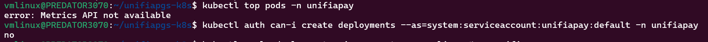

**Print 12: Prova do securityContext (YAML)**
- **O que é**: Print do arquivo `k8s/03-api-deployment.yaml` mostrando `securityContext`
- **O que Prova**: Diretivas `runAsNonRoot: true` e `runAsUser: 1000`

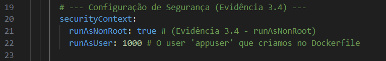

**Print 13: Prova de Permissão Restrita**
- **O que é**: Output de `kubectl auth can-i create deployments -n unifiapay`
- **O que Prova**: Service Account com permissões restritas (resposta `no`)

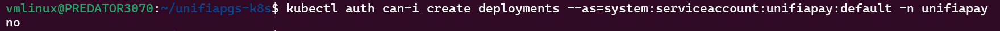
---

## 🤝 Contribuindo

Este é um projeto acadêmico. Sugestões e melhorias são bem-vindas!

---

## 📄 Licença

Projeto desenvolvido para fins educacionais - UniFIAP 2025

---

## 👨‍💻 Autor

**RM556786** - Desafio UniFIAP Pay SPB

---

## 📚 Referências

- [Kubernetes Documentation](https://kubernetes.io/docs/)
- [Docker Best Practices](https://docs.docker.com/develop/dev-best-practices/)
- [Node.js Alpine Images](https://hub.docker.com/_/node)
- [Sistema de Pagamentos Brasileiro (SPB)](https://www.bcb.gov.br/estabilidadefinanceira/spb)