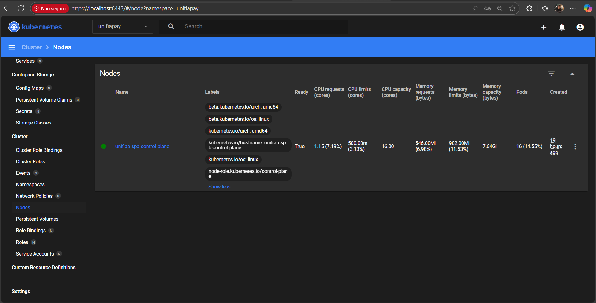
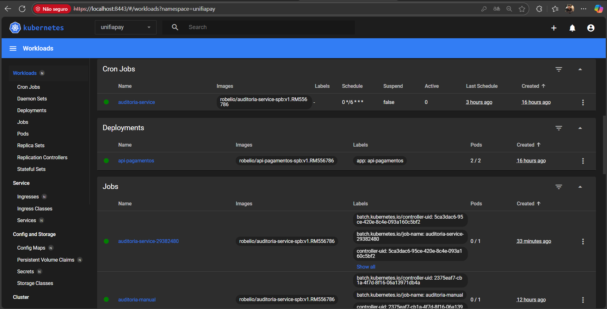
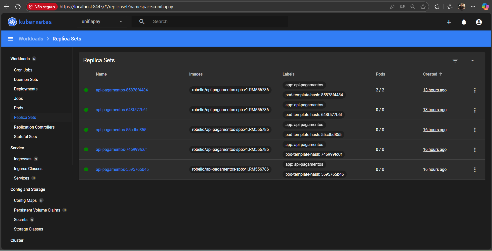
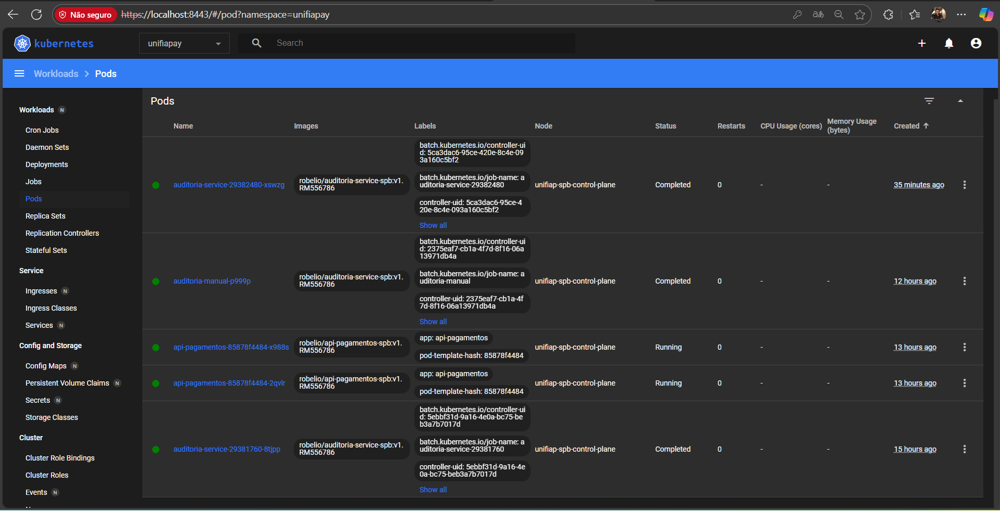

# 🎛️ Kubernetes Dashboard - Interface Web

## ⚠️ Nota sobre Rancher

Devido à incompatibilidade do Rancher com Kubernetes 1.34+, instalamos o **Kubernetes Dashboard** oficial como alternativa. Ele oferece funcionalidades similares e é totalmente compatível.

---

## 🚀 Acessando o Dashboard

### **1. Iniciar Port-Forward**

```bash
kubectl port-forward -n kubernetes-dashboard svc/kubernetes-dashboard 8443:443
```

### **2. Abrir no Navegador**

```
https://localhost:8443
```

⚠️ **Aceite o certificado autoassinado** (clique em "Avançado" → "Continuar")

### **3. Token de Acesso**

Use este token para fazer login:

```
eyJhbGciOiJSUzI1NiIsImtpZCI6InFEU19Xak5zTkVuS0xjcmhRQlMwYzBIdWFmWlYtMDNSMWp0dFpBa2hzUkEifQ.eyJhdWQiOlsiaHR0cHM6Ly9rdWJlcm5ldGVzLmRlZmF1bHQuc3ZjLmNsdXN0ZXIubG9jYWwiXSwiZXhwIjoxNzYyOTE4NzA4LCJpYXQiOjE3NjI5MTUxMDgsImlzcyI6Imh0dHBzOi8va3ViZXJuZXRlcy5kZWZhdWx0LnN2Yy5jbHVzdGVyLmxvY2FsIiwianRpIjoiNmQ3MzgyY2UtMGY4YS00MWUzLWExOWQtMGVlYzFiYjIxNDI0Iiwia3ViZXJuZXRlcy5pbyI6eyJuYW1lc3BhY2UiOiJrdWJlcm5ldGVzLWRhc2hib2FyZCIsInNlcnZpY2VhY2NvdW50Ijp7Im5hbWUiOiJhZG1pbi11c2VyIiwidWlkIjoiNGRiYTFmYTUtNjEwZC00NDEwLWEwYjYtZTkxOTg4M2NjZTFmIn19LCJuYmYiOjE3NjI5MTUxMDgsInN1YiI6InN5c3RlbTpzZXJ2aWNlYWNjb3VudDprdWJlcm5ldGVzLWRhc2hib2FyZDphZG1pbi11c2VyIn0.BRTdjRSCHOWMfXgV57hIEL9P3xwoillzmJ91t52GmyoFxT3FUF3EpptsHNANlCkqJfH3HsSQh1jZjMISPFdVP0FWYGys6wpbVnBzRolS9kEJd74oFBzIUaUagF-XEFqeK2vX9yTt5j6pXq0_eAYT48KmdXRPu1uoEuPlrrGggcMQqlRKqWa132sP98noBavdtS4cz87Ef9ur3jUrXXniS0XL5fSwxR2c9ki1LUtZ_HMXigcC-tG-D-7xH6XkDOs7MJO5F_GBNp4I7FB_9ooclSw74Pcyc9jgHVsJ8ad7Br_CX9dnp3kFIdMvlYxlD-GrsLumyjf60Vj7jhQCiUt-lw
```

### **4. Gerar Novo Token (se expirar)**

```bash
kubectl -n kubernetes-dashboard create token admin-user
```

---

## 📊 Gerenciando o Projeto UniFIAP Pay

### **Visualizar Recursos:**

1. No menu lateral, selecione o namespace: **`unifiapay`**
2. Acesse as seções:

#### **Workloads → Deployments**
- Veja: `api-pagamentos` (2 réplicas)
- Ações: Escalar, editar, ver detalhes

#### **Workloads → Pods**
- Veja todos os pods rodando
- Clique em um pod para:
  - Ver logs em tempo real
  - Executar shell
  - Ver métricas (CPU/Memory)

#### **Workloads → Cron Jobs**
- Veja: `auditoria-service`
- Agende execução manual
- Veja histórico de Jobs

#### **Storage → Persistent Volume Claims**
- Veja: `livro-razao-pvc` (1Gi)
- Verifique uso de armazenamento

#### **Config and Storage → Config Maps**
- Veja: `api-config`
- Visualize: `RESERVA_BANCARIA_SALDO=1000000.00`

#### **Config and Storage → Secrets**
- Veja: `api-secrets`
- Contém a chave PIX

---

## 🎯 Funcionalidades Disponíveis

### **1. Ver Logs em Tempo Real**
1. Workloads → Pods
2. Clique em um pod `api-pagamentos-...`
3. Ícone "Logs" no canto superior direito
4. ✅ Veja logs streaming!

### **2. Executar Shell no Container**
1. Workloads → Pods
2. Clique em um pod
3. Ícone "Exec" (terminal) no topo
4. Execute:
```bash
cat /var/logs/api/instrucoes.log
env | grep RESERVA
```

### **3. Escalar Deployment**
1. Workloads → Deployments → `api-pagamentos`
2. Clique no ícone "Editar" (lápis)
3. Altere `replicas: 2` para `replicas: 4`
4. Clique "Update"
5. ✅ Pods serão criados automaticamente!

### **4. Monitorar Recursos**
1. Workloads → Pods
2. Veja colunas: CPU, Memory
3. Clique em um pod para gráficos detalhados

### **5. Ver Eventos**
1. Cluster → Events
2. Filtre por namespace: `unifiapay`
3. Veja histórico de criação, escala, erros

---

## 🔧 Comandos Úteis

### **Port-Forward Permanente**
```bash
# Manter em background
nohup kubectl port-forward -n kubernetes-dashboard svc/kubernetes-dashboard 8443:443 > /tmp/dashboard.log 2>&1 &
```

### **Verificar Status**
```bash
# Pods do Dashboard
kubectl get pods -n kubernetes-dashboard

# Logs do Dashboard
kubectl logs -n kubernetes-dashboard deployment/kubernetes-dashboard
```

### **Parar Port-Forward**
```bash
pkill -f "port-forward"
```

---

## 📸 Screenshots para Evidências

Capture prints das seguintes telas para o desafio:

### **1. Login e Acesso**


### **2. Overview do Namespace unifiapay**


### **3. Deployments Rodando**


### **4. Pods em Execução**


### **5. CronJob Configurado**


---

## 🆚 Dashboard vs Rancher

| Recurso | Kubernetes Dashboard | Rancher |
|---------|---------------------|---------|
| Compatibilidade | ✅ K8s 1.34+ | ❌ < 1.34 |
| Interface | 🟢 Limpa e oficial | 🟢 Rica e completa |
| Recursos | 🟢 Básicos | 🟢🟢 Avançados |
| Instalação | 🟢 Simples | 🟡 Complexa |
| Peso | 🟢 Leve | 🟡 Pesado |
| Para este projeto | ✅ Perfeito | ⚠️ Incompatível |

---

## 🔐 Segurança

O token criado tem **permissões de cluster-admin**. Para produção:

### **Criar Token com Permissões Limitadas**
```bash
# Editar dashboard-admin.yaml
# Trocar: cluster-admin → view (somente leitura)
```

### **Revogar Acesso**
```bash
kubectl delete clusterrolebinding admin-user
kubectl delete serviceaccount admin-user -n kubernetes-dashboard
```

---

## 🎓 Recursos

- [Documentação Oficial](https://kubernetes.io/docs/tasks/access-application-cluster/web-ui-dashboard/)
- [GitHub do Dashboard](https://github.com/kubernetes/dashboard)
- [Tutorial em Vídeo](https://www.youtube.com/results?search_query=kubernetes+dashboard+tutorial)

---

## 🚀 Começar Agora

```bash
# 1. Iniciar port-forward
kubectl port-forward -n kubernetes-dashboard svc/kubernetes-dashboard 8443:443

# 2. Abrir navegador
# https://localhost:8443

# 3. Cole o token acima

# 4. Selecione namespace: unifiapay

# 5. Explore seus recursos! 🎉
```

---

**Desenvolvido para**: UniFIAP Pay SPB - RM556786  
**Cluster**: Kind (Kubernetes 1.34.0)  
**Dashboard**: v2.7.0
